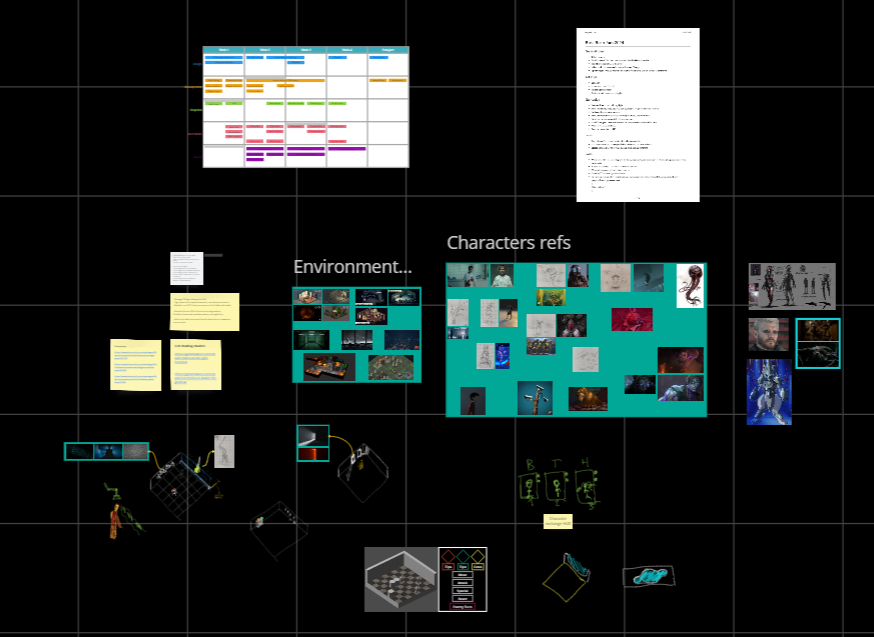

import { StoreLinkBanner, ProjectDetails, EmbedVideo, Collapsible } from '@/partials/post-components';

<div style="text-align: justify">
  {frontmatter.title} is a <b>turn-based tactics</b> game made for <a href="https://itch.io/jam/boss-rush-jam-2024">Boss Rush Jam 2024</a>.
  Features an aesthetic inspired by TV serie "Stranger Things" and games like "Control" and "Alan Wake".
</div>

<StoreLinkBanner
  gitHubUrl='https://github.com/ironcutter24/boss-rush-jam-2024'
  itchUrl='https://ironcutter24.itch.io/lab-escape'
/>

<ProjectDetails
  role='Project Manager - Designer - Lead Developer'
  company={frontmatter.studio}
  platforms={frontmatter.platforms}
  time={frontmatter.duration}
/>

## My contributions

<Collapsible title="Design and concepting">
I co-designed the game mechanics, gathered references and drew concept art for all characters.
The production for this project was managed in Miro,
that contains all my sketches, as well as a general design document and project roadmap.

</Collapsible>

<Collapsible title="Gameplay programming">
- A* navigation for unit movement validation
- Set of different actions and reactions for the cast of characters
- UI showing gameplay hints and characters stats

The FSM library I developed to manage turns, player inputs and UI is available in its own [repo](https://github.com/ironcutter24/cs-state-machine) under MIT license.
Here is a usage example:
```csharp
private StateMachine<State> sm = new StateMachine<State>(State.FirstState);

sm.Configure(State.FirstState)
    .SubstateOf(State.BaseState)
    .OnEntry(() => { /* Entered */ })
    .OnProcess(() => { /* Processing... */ })
    .OnExit(() => { /* Exited */ })
    .AddTransition(State.OtherState, () => firstCondition())
    .AddTransition(State.AnotherState, () => secondCondition());
```
</Collapsible>

<Collapsible title="Utility-based AI">
- Modular score calculation methods, trying to achieve goals like: get close to attack targets, avoid attack trajectories, avoid getting surrounded.
- It is possible to create multiple AIs composing score calculation methods.
</Collapsible>
