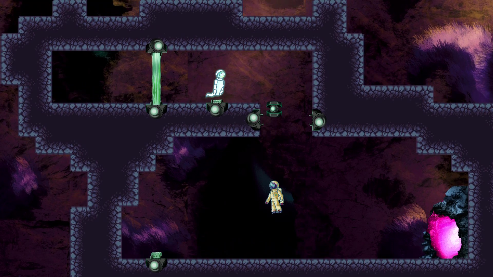
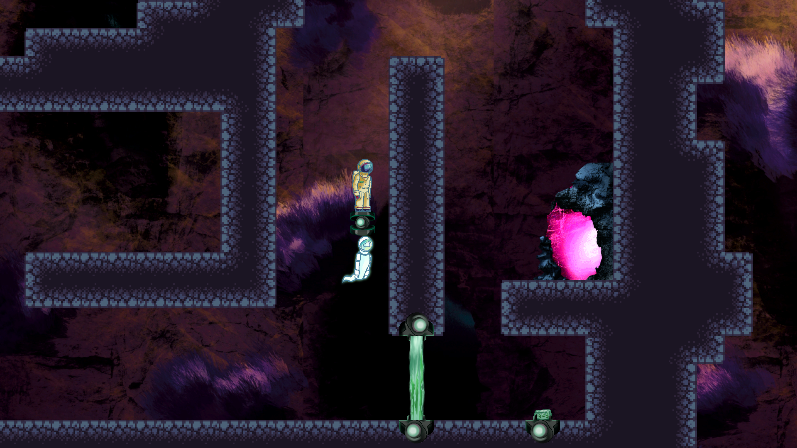
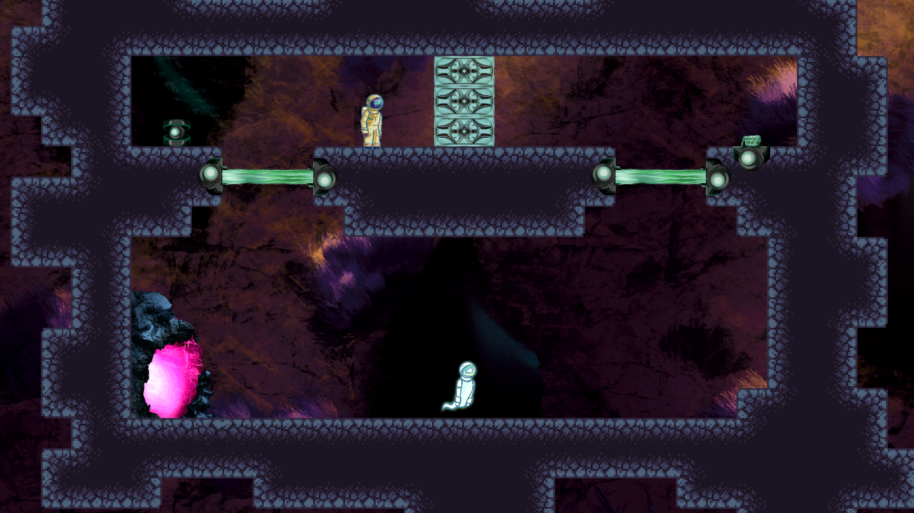
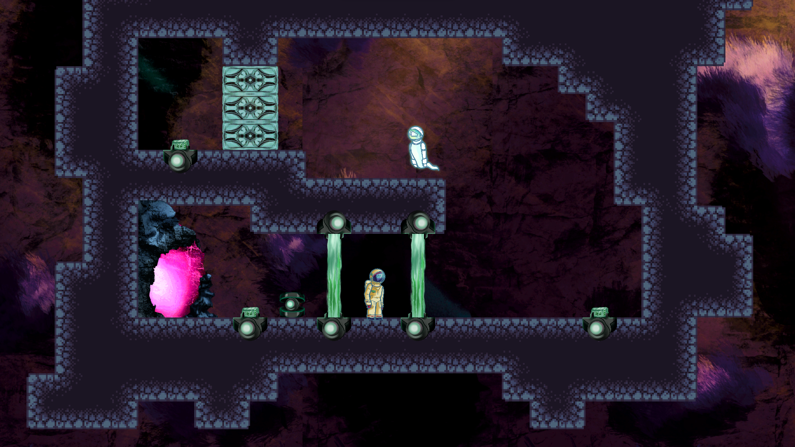
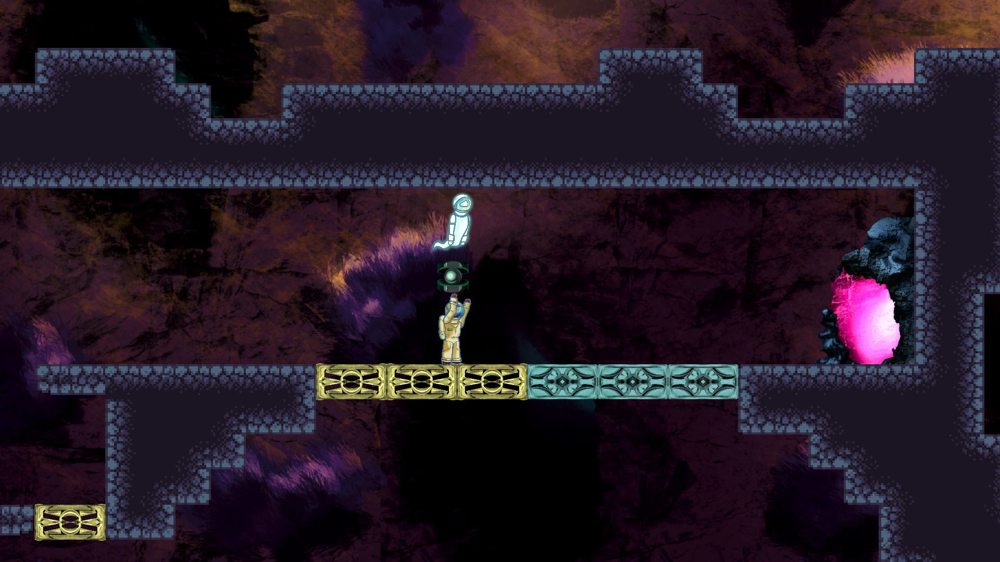
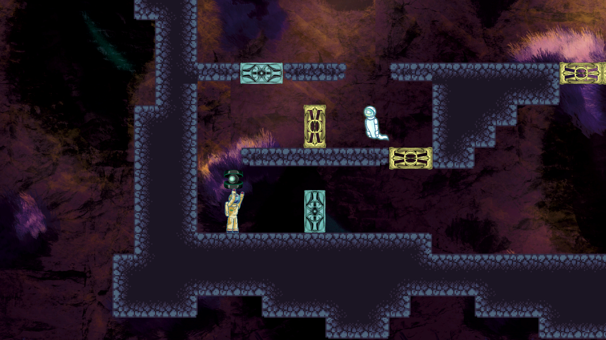

import { StoreLinkBanner, ProjectDetails, EmbedVideo } from '@/partials/post-components';

{frontmatter.title} is a <b>2D puzzle platformer</b> where the player controls two characters on distinct planes of existence. 
They cannot interact with each other, and are blocked by walls made of their material (Solid and ghost). 
The game achieved the 52nd place for the best mechanics in [GameDevTV Jam 2023](https://itch.io/jam/gamedevtv-jam-2023).

<StoreLinkBanner
  gitHubUrl='https://github.com/ironcutter24/GDtvJam2023'
  itchUrl='https://ironcutter24.itch.io/afterimage'
/>

<ProjectDetails
  role='Director - Designer - Developer'
  company={frontmatter.studio}
  platforms={frontmatter.platforms}
  time={frontmatter.duration}
/>

## My contributions
> 1. Coordinated a team of 4 people
> 1. [Gameplay design/development](#gameplay)
> 1. [Designed 4 levels and polished 2 others](#level-design)
> 1. Animated the astronaut character
> 1. Created intro and ending cutscenes

## Gameplay
<EmbedVideo url="https://www.youtube.com/embed/I0cuBfJZC24?si=9Dg-G2eXKbRtnKnJ" />

Implemented character movement and grab ability, making sure that it is possible to carry each other on the cube.
Programmed camera dynamic framing and all interactive objects.

## Level Design
I crafted four levels and conducted refinements on others,
which involved the refactoring and simplification of the final level.

**Polishing:** Added drop to teach the box-grabbing mechanic.

**LV 2 design:** Teaches players they can launch the cube upwards.

**LV 4 design:** Teaches players they can carry each other on the cube.

**LV 6 design:** Guides players toward an apparent solution,
just to reveal the catch: cubes can't pass through gates.
This one also includes the upward cube launch introduced in LV 2.

{/*
**LV 7 design:** Generic doors level

*/}

**LV 8 design:** "The Bridge" level. Uses the cube carry in a more complex way.

**Design:** Designed the cube gate utilized in multiple levels.

